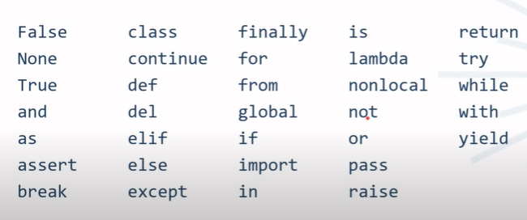
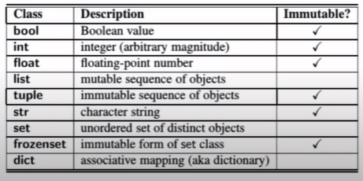

# SEMANA 3
En esta semana se hace una introduccion al lenguaje Python

___

- **Identamos**: mover hacia la derecha el codigo
- **Objetos**: es la forma en que python representa los valores, en python todos los valores son objetos.
- En python **no** funciona el ++
- Los **identificador** se asocian a un objeto
- Los identificadores son sensitivos a mayusculas

### Palabras reservadas
No se pueden utilizar como identificadores

***Tipado Dinamico:***
Los identificadores pueden asignarse a objetos de distintos tipos

***Alias:***
Varios nombres o varios identificadores para el mismo objeto

### Clases Predefinidas
Son clases que no necesitan ser importadas para ser usadas

#### Clases mutables
El objeto de dicha clase una vez que a sido creado puede cambiar su valor

#### Clases inmutables
El objeto de dicha clase una vez que a sido creado **NO** puede cambiar su valor

## Clases Numericas
    * Bool
    * Int
    * Float

### Clase Bool
- Solo tiene dos posibles instancias: True y False
- El Constructor `bool()` puede aceptar diferentes tipos de argumentos
- Los numeros se evaluan a *False* si son cero caso contrario son *True*
- Las secuencias (list, tuple y str) se evaluan a False si estan vacias de o contrario a True

### Clase Int
- La magnitud de los enteros es arbitraria.
- El constructor `int()` puede recibir numeros flotantes y los trunca.
- Recibe cadenas validas y hace la conversion.

### Clase Float
- Es el unico tipo por defecto para el manejo de numeros flotantes en python.
- Utiliza la representacion de precision fija(no arbitraria como el tipo int).
- El constructor `float()` acepta enteros y cadenas.
- `float(True)` retorna 1.0, `float(False)` retorna 0.0

## Clases de Secuencias
Sus elementos tienen un orden finito, son contenedores de otros objetos

    - list
    - tuple
    - str

### Clase list
- Son mutables
- Almacena las direcciones de memoria de los objetos
- Utiliza indices basados en 0
- No existe el tipo array de manera predefinida
- Las listas pueden aumentar y disminuir su tamaño
- El constructor es `list()`

### Clase tuple
- Son inmutables. Las operaciones son mas eficientes
- Estan basadas en referencias
- Utilizan parentesis en vez de corchetes

### Clase str
- Secuencia inmutable de caracteres Unicode.
- Pueden estar encerrados entre comillas dobles o simples
- Es posible usar contrapleca `\` como caracter de escape, pero para que forme parte de la cadena se debe escapar
- Existen string con comillas triples `""" """`

## Clases de Conjunto
    - Set
    - Frozenset

- Representan una coleccion de elementos unicos y sin un orden inherente
- Estan optimizados para consultar si un elemento pertenece o no al conjunto
- Solo tipos inmutables pueden ser pare de un set o frozenset
- Dado que los frozenset son inmutables, un set puede contener frozensets
- los set son mutables
- Los set tienen aplicacion en eliminar elementos repetido de una lista
- Para un declarar un conjunto vacio se utiliza el set() 
- los conjuntos se delimitan por llaves

## Clases Diccionarios
- Son conjuntos de pares claves-valor
- Las claves son inmutables
- Los valores pueden ser mutables o inmutables
- para crear un diccionario con el constructor `dic([("a",3),("c",3)])`
